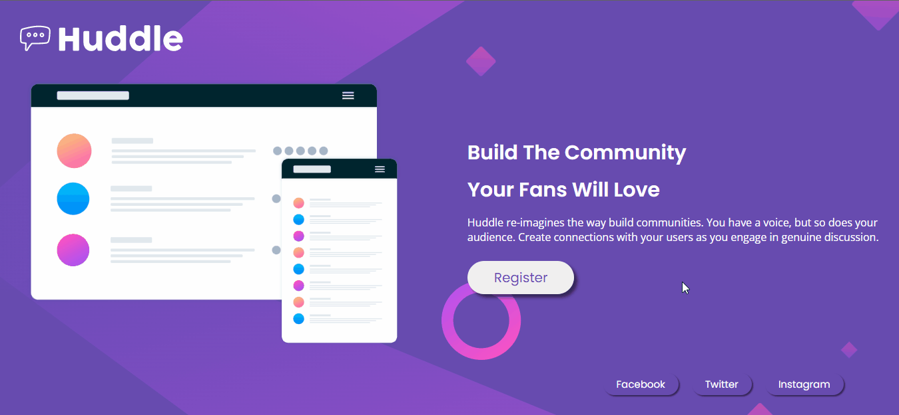

<h1 align="center"> Huddle </h1>

<h2 align="center">The Landing page of this project was created with HTML and CSS.</h2>

 

Desktop image:

Mobile image:

---
## 💻**How was it done?**
This project is a challenge from [Frontend Mentor](https://www.frontendmentor.io/challenges/huddle-landing-page-with-a-single-introductory-section-B_2Wvxgi0), I was inspired by the layout and created the project using CSS FlexBox techniques.

  

### 🎨 **Project Colors**:
- Violet: `hsl(257, 40%, 49%)`
- Soft Magenta: `hsl(300, 69%, 71%)`

  

### ⚡ Access the [project online](https://laisbagno.github.io/Huddle/)

---
### 💎 Follow me on [linkedin](https://www.linkedin.com/in/laisbagno/)
